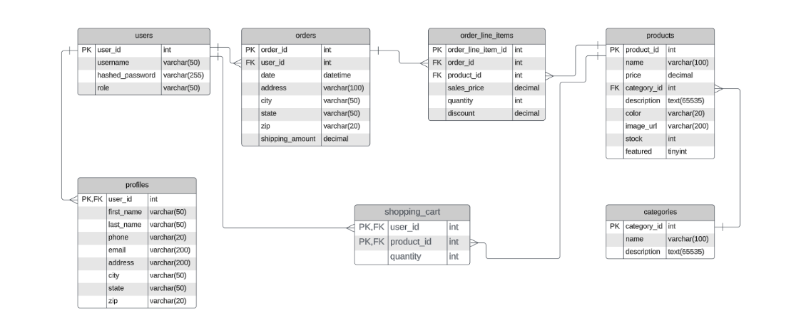
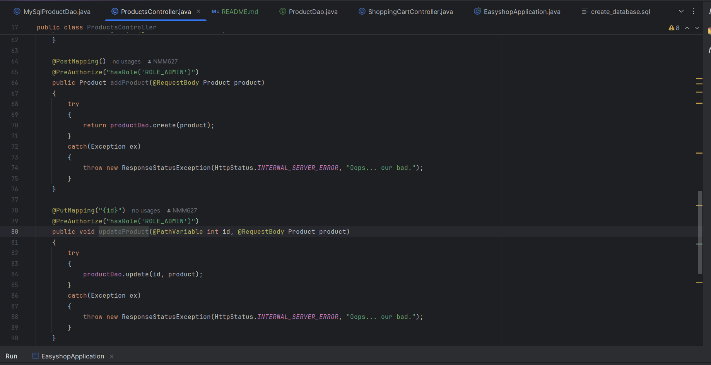

EasyShop
Navigation of an online shop 
Briefly describe what this Java console application does. Mention its purpose and who the intended users are. Explain the main functionality and what problems it aims to solve.

Class Diagram

User Stories

As a user, I want to be able to implement the proper methods.
As a user, I want to be able to detect the bugs in order to make the website run properly.
Setup
Instructions on how to set up and run the project using IntelliJ IDEA.

Prerequisites
IntelliJ IDEA: Ensure you have IntelliJ IDEA installed, which you can download from here.
Java SDK: Make sure Java SDK is installed and configured in IntelliJ.
Running the Application in IntelliJ
Follow these steps to get your application running within IntelliJ IDEA:

Open IntelliJ IDEA.
Select "Open" and navigate to the directory where you cloned or downloaded the project.
After the project opens, wait for IntelliJ to index the files and set up the project.
Find the main class with the public static void main(String[] args) method.
Right-click on the file and select 'Run 'YourMainClassName.main()'' to start the application.
Technologies Used
Java: Mention the version you are using.
Any additional libraries or frameworks used in the project.
Postman and MySQL WorkBench were used to run the application.
Demo
Include screenshots or GIFs that show your application in action. Use tools like Giphy Capture to record a GIF of your application.

Future Work
Outline potential future enhancements or functionalities you might consider adding:

Additional feature to be developed.
Improvement of current functionalities.
Resources
List resources such as tutorials, articles, or documentation that helped you during the project.
None at this time.

Java Programming Tutorial
Effective Java
Team Members
I want to thank Ben Bergman for all of his help even with his most recent setback he still kept going and pushing through to finish strong as well as a huge shoutout to everyone for finishing strong in this last capstone and the program overall, congrats!
Thanks

I also want to thank Mr Teacher Man, The Head Coach of the Steel Potatoes. The legendary Raymond Maroun for all of his help and hard work throughout his 12 weeks guiding us through this bootcamp, could not have done it without you!